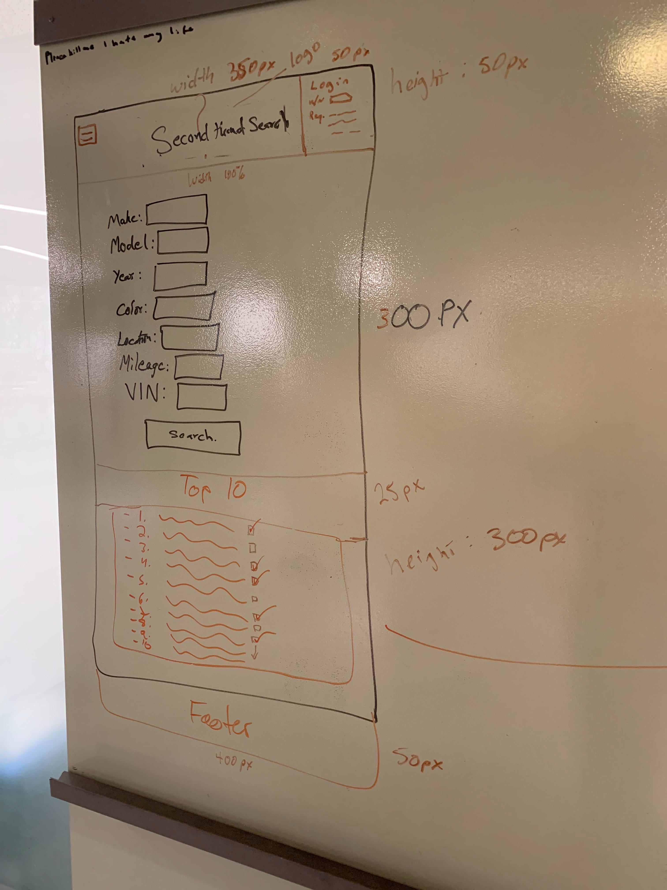
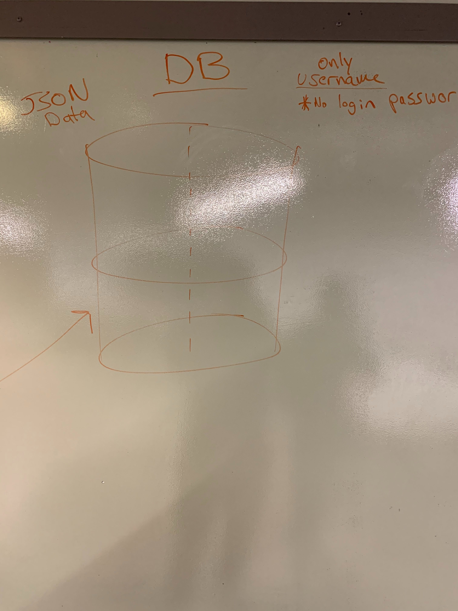
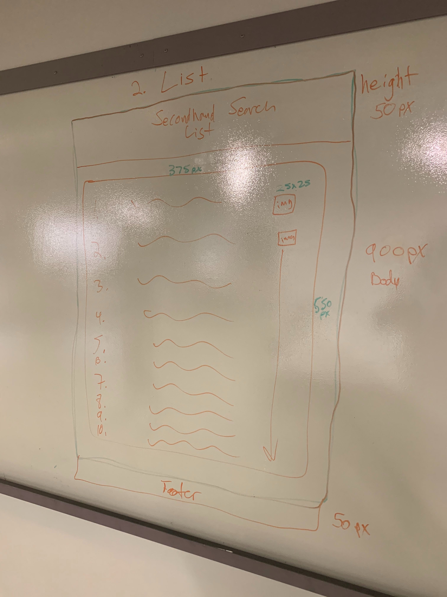
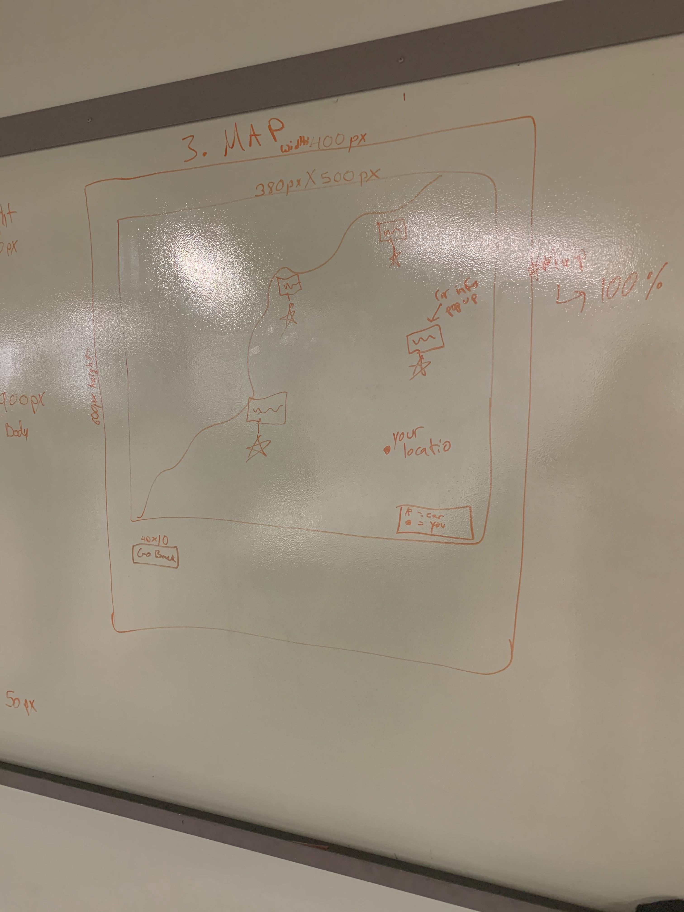
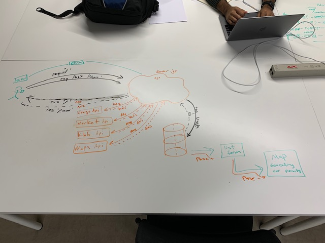
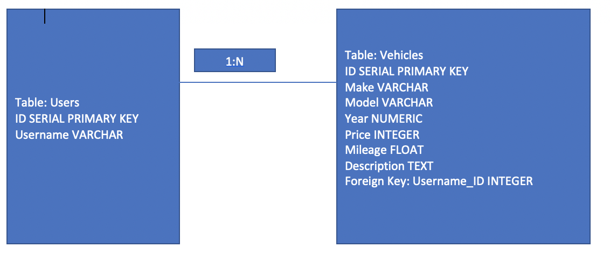

# SecondHandSearch

Developers: Greg Mireles, Phong Doan, Jitendra Bajracharya, Dayne Daylong

Description: 
App for third party sellers and buyers (i.e. craigslist, Offerup, LetGo) which checks price for selling and buying vehicles and if you would like to find vehicle within a radius of a zip code, the app will give location and vehicles for sale within the area you choose. You can even toggle between a list or map.

Trello: https://trello.com/b/gixvWqmQ/secondhandsearch

Heroku: https://dashboard.heroku.com/apps/secondhandsearch

=====================================================================================

                                WIREFRAME

=====================================================================================                    

=====================================================================================

                                User Stories
                                
===================================================================================== 

1. Search for second hand vehicle
2. As a user, I would like to find second hand vehicles around the area that I pick. 
3. The user will be displayed the form with the list of selection criteria such as make, model, location, year, mileage to search for the vehicle. 
4. Ensuring the search query the API from craigslist and display the list of vehicles. 

 //////////////////////////////////////////////////////////////////////////////////////////////////////

1. Save to Wish List
2. As a user, I would like to save the vehicles that I’m interested in so that I can come back to it anytime check back into that vehicle.
3. Collect the vehicle information with username and save it to the database.
4. Ensuring the user is asked to enter username if the user has not already provided the username.

 //////////////////////////////////////////////////////////////////////////////////////////////////////
 
1.    Make changes to saved list.
2.    As a user, I want to be able to remove or add more vehicles in my wish list.
3.    Adding remove features in saved list the remove the vehicle from saved list.
4.    Ensuring that the vehicle removed from the list is deleted from the database and doesn’t show again in the refreshed display.

 //////////////////////////////////////////////////////////////////////////////////////////////////////
 
1.    See the vehicle location in map.
2.    As a user, I want to be able to view the map giving me the general location of the vehicle.
3.    On the list of vehicles displayed, the user will be displayed a button to open the location of the vehicle in the map.
4.    Ensuring that the map uses the google api and reference with the correct location.

 //////////////////////////////////////////////////////////////////////////////////////////////////////

1.    See the number count of vehicle displaying in each search
2.    As a user, I want to know the number of vehicles that populate in my every search so that I can readily know the number of vehicles available within the searched area.
3.    On the search result page, it will display the number of vehicles populated up on the top of the page.
4.    Ensuring that the page get the correct count and only get the number of vehicles that is on display.

=====================================================================================

                                Domain Modeling

=====================================================================================   

=====================================================================================

                                Database ERD

=====================================================================================   

User table is to login in users to veiw their own data from the database.
Vehicle table is to store vehicle data from API.