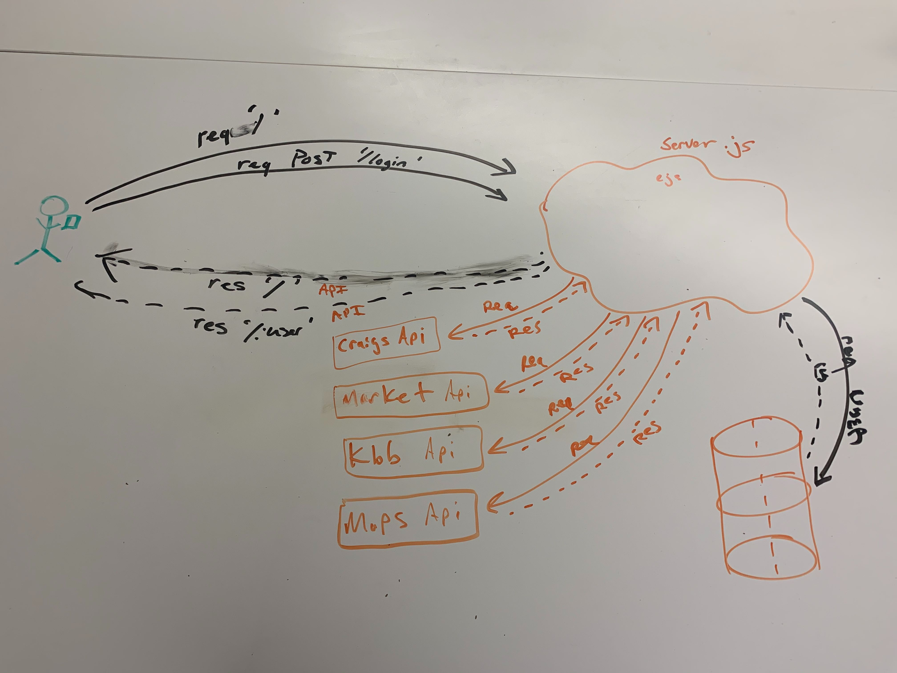

What is the vision of this product?

For users to be able to search for the best possible price for a vehicle of their choosing.

What pain point does this project solve?

Users want to be able to search for type of vehicle or by price within a location. Users want to save it within a database to compare other cars. Users want the best possible price for the vehicle.

Why should we care about your product?

Increases user experience by combining vehicle search and best pricing for the vehicle. This is an all in one when looking for a vehicle with the upmost value.

Scope (In/Out)
IN - What will your product do
Describe the individual features that your product will do.
High overview of each. Only need to list 4-5
Example:
The web app will provide information to the users about all the different vehicles for sale in the area.
The web app will provide both directions to each of the vehicles if the user chooses so.
Users will be able to add their selected vehicle to the database for later veiwing and comparing.

OUT - What will your product not do.
Web app will not be able to purchase.
Web app will not be able to accept input of vehicles to add to global API databases.

Minimum Viable Product vs
What will your MVP functionality be?

Form Rendered with User inputs to search for criteria and after submission list page rendered from API. User selects Data/vehicles to be saved to the database for later viewing and comparison. The view of the results will have location of the vehicles within a list of saved vehicles with data to include location, price, mileage, year, make, model, color, and add-ons/features.

What are your stretch goals?

Parts ad prices from the NHTSA API.
Locations of the vehicles in the area to have a route from location of the user.

Stretch
What stretch goals are you going to aim for?
Locations of the vehicles in the area to have a route from location of the user.

Functional Requirements
List the functionality of your product. This will consist of tasks such as the following:

An user can create  user accounts
A user can search all of the products in the inventory of the API
A user can add product to database from API
A user can  view detailed view and veiw the location on a map to get directionsl

Data Flow
Describe the flow of data in your application. Write out what happens from the time the user begins using the app to the time the user is done with the app. Think about the “Happy Path” of the application. Describe through visuals and text what requests are made, and what data is processed, in addition to any other details about how the user moves through the site.

Non-Functional Requirements (301 & 401 only)
Non-functional requirements are requirements that are not directly related to the functionality of the application but still important to the app.

Examples include:

Security
Usability
Testability
etc….
Pick 2 non-functional requirements and describe their functionality in your application.

If you are stuck on what non-functional requirements are, do a quick online search and do some research. Write a minimum of 3-5 sentences to describe how the non-functional requirements fits into your app.

You MUST describe what the non-functional requirement is and how it will be implemented. Simply saying “Our project will be testable for testibility” is NOT acceptable. Tell us how, why, and what.

Usability - Users must be able to access site and traverse the site with ease. The user needs to be able to login and search for the vehicle within the first page. The user must be able to navigate to the result pages.

Data Integrity - the App will be grabbing the data from three different APIs, but data changes constantly, so we will have to update the data within the database to match current data.